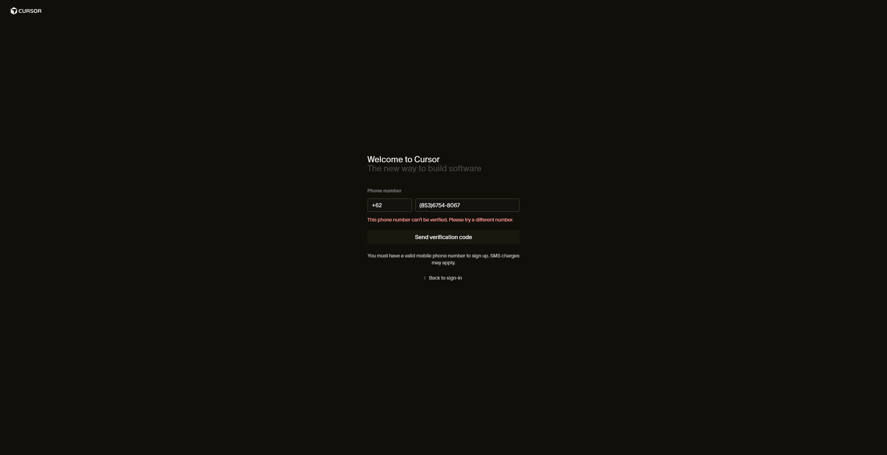

# 100Hires - Junior Growth Marketing Specialist | Dan
## What tools you installed
- [Cursor IDE](https://cursor.com/)
- [Visual Studio Code](https://code.visualstudio.com/) (already familiar with extensions like Codex or Claude Code in VSCode)

## What steps you completed
- Installing Cursor IDE for Windows
- Creating a public GitHub repository
- Creating README.md

## What issues you ran into and how you solved them
- Phone verification for signing up in Cursor

```
Currently, I am not able to fix the issue, asked some software engineer friends and they're encountering same issue for Indonesia region. Will try to research more how to fix the issue for Indonesia users.
```